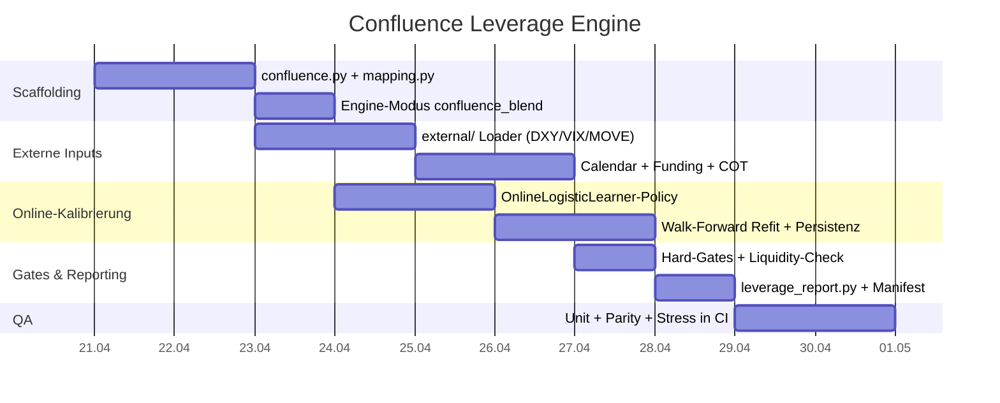

# TEMA-Live-v2 — Confluence Leverage Engine

> Design-Dokument für eine **Confluence Leverage Engine (CLE)** im Repo [orga-davidv/TEMA-Live-v2](https://github.com/orga-davidv/towards/TEMA-Live-v2). Ergänzung zur [TEMA-Live-v2 — src/ Workflow (Mermaid)](https://www.notion.so/TEMA-Live-v2-src-Workflow-Mermaid-54770c18c3af4f24be891639fdaa8422?pvs=21).
> 

## 1. Ausgangslage

Repo-Scan zeigt: `src/tema_template/leverage/{engine.py, kelly.py, cppi.py, vol_target.py}` ist live. `engine.py` bietet `conservative_min` und ein gewichtetes `weighted_kelly_vol_target`-Blend (`rl_weight`). Risk-Guardian (`risk_guardian.py`), DCC-Breakdown (`dcc_breakdown.py`), Hurst (`econophysics/hurst.py`, `feature_stage._build_hurst_features`), Microstructure (`features/microstructure.py`) und Kramers-Moyal (`econophysics/kramers_moyal.py`) sind alle da. Was fehlt: **diese Signale orchestriert in einen einzigen Hebel-Entscheid zu gießen**.

## 2. Offene Lücken trotz „alles umgesetzt“

- [ ]  **Leverage-Entscheidung ist binär-konservativ.** `engine.py` nimmt `min(kelly, vol_target_regime)` oder einen festen `rl_weight`-Mix — reagiert nicht auf Regime-Qualität, Korrelations-Breakdown, Tail-Risk oder ML-Confidence.
- [ ]  **Risiko-Skalare multiplizieren sich** (`cvar_scale * dd_scale * correlation_scale * tail_scale`) — Bug-Report #9: fällt in Stress-Phasen auf ~0.12 und killt Mean-Reversion-Bounces. Braucht eine aggregierende statt multiplikative Logik.
- [ ]  **Confluence/Consensus-Layer fehlt.** Es gibt viele Einzel-Scores (HMM-P(bull), Hurst, DCC, Vol-of-Vol, Power-Law-Tail, RF-Prob, Sentiment), aber keinen gemeinsamen **Konfluenz-Score** und kein Mapping *Score → Hebel*.
- [ ]  **Keine externen Inputs.** Makro-Regime, COT/Positioning, Calendar-Blackouts (FOMC/NFP/CPI), Cross-Asset-Risk-On-Proxies (DXY, VIX, MOVE, Credit-Spreads), Funding-Rates — all das wird nicht berücksichtigt.
- [ ]  **Online-Kalibrierung fehlt.** `OnlineLogisticLearner` existiert für Signal-Ensemble, aber nicht für die Leverage-Policy.
- [ ]  **Keine Leverage-Explainability im Manifest.** `compute_leverage` schreibt zwar Diagnostics, aber kein Panel „warum heute 1.4× statt 2.0ד.

## 3. Design: Confluence Leverage Engine (CLE)

Kernidee: **Hebel ist eine Funktion eines normierten Konfluenz-Scores** $C_t in [0, 1]$, der aus internen (Strategie) und externen (Markt/Makro) Signalen aggregiert wird. Base-Leverage kommt weiter aus Kelly/Vol-Target/CPPI — CLE *moduliert* nur.

```mermaid
flowchart LR
	subgraph INT["Interne Konfluenzen (bereits im Repo)"]
		I1["HMM p_bull<br>(ml/regime.py)"]
		I2["Hurst H<br>(econophysics/hurst.py)"]
		I3["Vol-of-Vol<br>(features)"]
		I4["DCC Correlation<br>Breakdown"]
		I5["Power-Law Tail<br>(risk/tail_risk)"]
		I6["Signal-Stack<br>AND-Votes (EMA+ML+Risk)"]
		I7["Kramers-Moyal<br>Drift/Diffusion"]
		I8["Ensemble-Disagreement"]
	end

	subgraph EXT["Externe Konfluenzen (neu)"]
		E1["Makro-Risk-On<br>(DXY, VIX, MOVE, Credit)"]
		E2["Funding/Carry<br>(FX-Swap, Perp-Funding)"]
		E3["COT/Positioning"]
		E4["Event-Calendar<br>(FOMC, CPI, NFP)"]
		E5["Liquidity/Spread<br>(microstructure.py)"]
		E6["Sentiment/Ising-Proxy"]
	end

	INT --> AGG["Confluence Aggregator<br>z-score · winsorize · sign-align"]
	EXT --> AGG
	AGG --> C["Confluence Score<br>C_t ∈ [0, 1]"]
	C --> MAP["Mapping C → Leverage-Multiplier m_t"]

	subgraph BASE["Base-Leverage (vorhanden)"]
		B1["Fractional Kelly"]
		B2["Vol-Target (regime)"]
		B3["CPPI (peak-equity)"]
	end
	BASE --> L0["L_base = min(Kelly, VolTarget)"]
	L0 --> MUL["L_t = clip(m_t · L_base, 0, L_max)"]
	MAP --> MUL
	MUL --> GATE["Hard-Gates:<br>CPPI-Floor · Event-Blackout · Liquidity"]
	GATE --> OUT["L_final → Portfolio Sizing"]
```

### 3.1 Aggregation

$C_t = \sigma\left(\beta_0 + \sum_i \beta_i \cdot \tilde{x}_{i,t}\right)$

mit $\tilde{x}_{i,t}$ = winsorized/z-scored Einzelsignal, $\sigma$ = Sigmoid. Gewichte $\beta_i$ werden über `OnlineLogisticLearner` auf das Label „war der nächste Bar-Return > median“ kalibriert (rolling window, walk-forward).

### 3.2 Mapping $m_t = f(C_t)$

Drei Modi, per Config wählbar:

1. **`linear`** — $m_t = m_{min} + (m_{max} - m_{min}) cdot C_t$.
2. **`stepwise`** — Buckets (z. B. $C < 0.3 Rightarrow 0.5times$, $0.3!-!0.7 Rightarrow 1.0times$, $> 0.7 Rightarrow 1.5times$) — robust gegen Outlier.
3. **`kelly-shrink`** — $m_t = C_t^\gamma$ mit $\gamma \in [1, 3]$ (je höher $gamma$, desto defensiver bei niedrigem Konsens).

### 3.3 Hard-Gates (überschreiben $m_t$ immer)

- **CPPI-Floor:** $L_t$ darf nie Equity unter Floor drücken.
- **Event-Blackout:** 60 min vor/nach FOMC/CPI/NFP → $L_t = min(L_t, 0.5)$.
- **Liquidity-Gate:** `spread_z > 2` oder `depth < q_{10}` → $L_t leftarrow 0.25 cdot L_t$.
- **Correlation-Breakdown-Alert** (`dcc_breakdown.alert=True`) → $L_t leftarrow min(L_t, 1.0)$.

## 4. Konkrete Integration im bestehenden Code

| Neu / Datei | Aufgabe | `src/tema_template/leverage/confluence.py` | `ConfluenceAggregator` (winsorize+zscore+sign-align), `ConfluenceConfig`, `compute_score()`. |
| --- | --- | --- | --- |
| `src/tema_template/leverage/mapping.py` | `linear / stepwise / kelly_shrink` Mapper, `ConfluenceMappingConfig`. | `src/tema_template/leverage/engine.py` *(erweitern)* | neuer Modus `confluence_blend`: nutzt `L_base` aus Kelly/VolTarget und multipliziert $m_t$. |
| `src/tema_template/external/` *(neu)* | Loader für DXY/VIX/MOVE/Credit/Funding/COT/Calendar (CSV oder API-Stubs). | `src/tema_template/leverage/gates.py` | Hard-Gates (Event-Blackout, Liquidity, Correlation-Alert). |
| `src/tema_template/leverage/online.py` | `OnlineLogisticLearner`-Anbindung, rolling-refit, Persistenz in Manifest. | `src/tema/pipeline/runner.py` *(erweitern)* | Stage *Leverage* zwischen `_ml_filter_and_scalar` und `run_return_equity_simulation`. |
| `src/tema/reporting/leverage_report.py` *(neu)* | Panel „Warum Hebel X heute?“ — Beiträge der Einzelsignale, $m_t$-Zeitreihe, Gate-Log. | `tests/test_confluence_leverage.py` | Unit-Tests + Parity-Fallback (`confluence_blend` ≈ `conservative_min` wenn alle $beta_i=0$). |

## 5. Akzeptanzkriterien (in CI verankern)

- [ ]  `confluence_blend` reduziert sich auf `conservative_min` wenn `beta=0` (Regressionstest).
- [ ]  Hebel **nie** > `leverage_cap` (hard clip), **nie** unter CPPI-Floor-implizierter Grenze.
- [ ]  OOS-Sharpe mit CLE ≥ Baseline ohne CLE **und** MC-Risk-of-Ruin ≤ Baseline.
- [ ]  Event-Blackout-Test: synthetischer FOMC-Bar → $L_t \le 0.5$ erzwungen.
- [ ]  Manifest enthält pro Bar: $C_t$, $m_t$, Beiträge $beta_i tilde{x}_{i,t}$, ausgelöste Gates.
- [ ]  Determinismus: zwei Runs mit gleichem Seed → identische Leverage-Zeitreihe (`atol=1e-12`).

## 6. Rollout-Plan (~2 Wochen)

## 7. Zusatz-Ideen auf der Todo-Liste

- [ ]  **Meta-Label für CLE-Training** aus Triple-Barrier (Lopez de Prado) statt nur „Return > median“ — reduziert Label-Rauschen.
- [ ]  **Risk-Parity-Variant des Confluence-Aggregators**: Einzelsignale auf gleiche Ex-ante-Vol skalieren, bevor summiert wird (verhindert Dominanz eines lauten Features).
- [ ]  **Hebel-Smoothing** via EWMA ($lambda approx 0.7$) auf $L_t$ — gegen Whipsaws, aber mit Override bei Gate-Alerts.
- [ ]  **Ablation-Runner** (`scripts/run_confluence_ablation.py`): dreht einzelne $\beta_i$ auf 0 und misst Sharpe-/DD-Delta — macht Feature-Value sichtbar.
- [ ]  **Live-Guardrail**: wenn $|L_t - L_{t-1}| > 0.5$ in einem Bar → Alert + optionaler Rebalance-Block.
- [ ]  **Multi-Horizont-Confluence**: $C_t^{(1h)}, C_t^{(1d)}, C_t^{(1w)}$ parallel rechnen; Hebel nur hoch, wenn mindestens 2 von 3 Horizonten zustimmen (klassische Konfluenz-Logik für Trader).