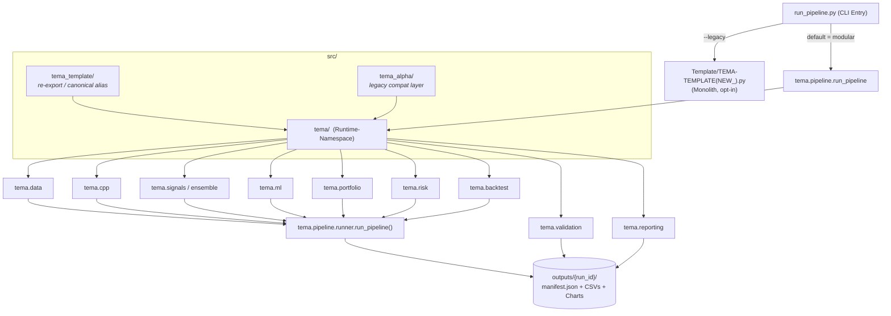
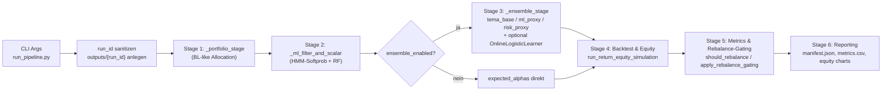
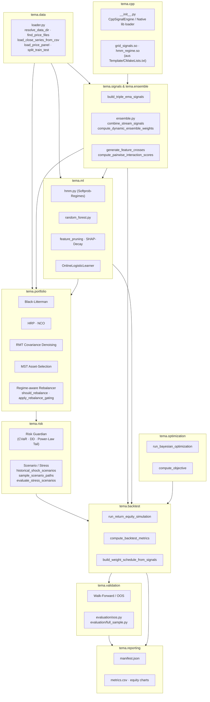
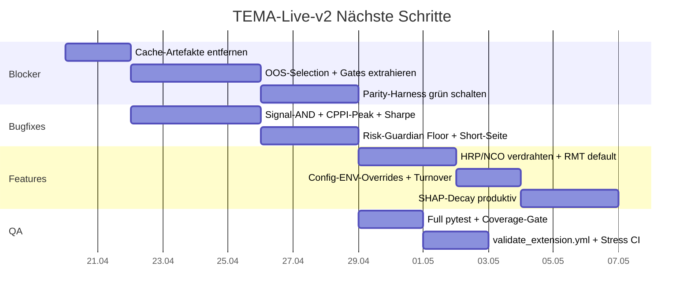

# TEMA-Live-v2 — src/ Workflow (Mermaid)

> Skizze des kompletten Workflows vom `src/`-Ordner im Repo [orga-davidv/TEMA-Live-v2](https://github.com/orga-davidv/TEMA-Live-v2). Basierend auf `src/tema/__init__.py`, `src/tema/pipeline/runner.py`, `run_pipeline.py` sowie den Docs (`MERGE_GAP_AUDIT`, Blueprint).
> 

## 1. High-Level Übersicht

## 2. Namespace-Struktur in `src/`

Drei parallele Python-Pakete, die alle auf den gleichen Code zeigen:

- **`src/tema/`** — Runtime-Namensraum mit der tatsächlichen Implementierung. `__init__.py` exportiert die öffentliche API (`BacktestConfig`, `Runner`, `run_bayesian_optimization`, `compute_objective`, `DynamicEnsembleConfig`, `OnlineLogisticLearner`, `compute_position_scalars`, `allocate_portfolio_weights`, `run_return_equity_simulation`, `BacktestResult` …).
- **`src/tema_template/`** — laut Blueprint *kanonischer* Runtime-Namespace. Aktuell re-exportiert `tema_template/__init__.py` lediglich die Public API von `tema` (`__all__ = getattr(__import__("tema"), "__all__", [])`).
- **`src/tema_alpha/`** — Compatibility-Layer für Legacy-Imports. Jedes Submodul (`data`, `indicators`, `strategy`, `evaluation`, `optimization`, `pipeline`, `reporting`, `visualization`, `backtest`, `config`, `ml`, `portfolio`, `features`) leitet via `import_module("tema_template.<mod>")` / `populate_package` weiter.

## 3. Pipeline-Ablauf (`tema.pipeline.runner.run_pipeline`)

**Quellen:** `src/tema/pipeline/runner.py` (`run_pipeline`, `_portfolio_stage`, `_ml_filter_and_scalar`, `_ensemble_stage`), `src/tema/ensemble.py` (`STREAM_NAMES = ("tema_base", "ml_proxy", "risk_proxy")`), `src/tema/backtest.py` (Annualisierung, Gewichts-Normalisierung), `run_pipeline.py` (CLI-Flags: `--legacy`, `--stress-enabled`, `--modular-data-signals`, `--modular-portfolio`, `--ml-disabled`, `--ml-modular-path`, `--ml-prob-threshold`).

## 4. Modul-Landkarte unter `src/tema/`

## 5. Datenfluss End-to-End

1. **Input** — CSV-Kursdaten (`*_merged.csv`, `open_mid/high_mid/low_mid/close_mid/datetime`) via `tema.data.loader` eingelesen und per `split_train_test` in Train/Test zerlegt.
2. **Signal-Layer** — Triple-EMA-Crossover (`build_triple_ema_signals`) + optional C++-Engine aus `tema.cpp`. Gitter­suche + OOS-Selektion wählt `best_combo`.
3. **ML-Filter** — HMM-Soft­probabilities × Random-Forest-Regime-Scores → Positions-Scalar (`compute_position_scalars`, `threshold_probabilities`).
4. **Portfolio-Allokation** — MST-Asset-Selektion → RMT-Denoising → HRP/NCO/Black-Litterman → Gewichte (`allocate_portfolio_weights`, `PortfolioAllocationResult`).
5. **Leverage & Risk Guardian** — Kelly/CPPI-Sizing, CVaR-/DD-/Power-Law-Checks, Turnover- und Cost-Gates (`apply_rebalance_gating`).
6. **Backtest** — `run_return_equity_simulation` → `compute_backtest_metrics` (Sharpe, Sortino, MaxDD, Ulcer).
7. **Validation** — Walk-Forward/OOS, `evaluate_stress_scenarios`, Sharpe-Degradation.
8. **Reporting** — Schreibt `outputs/<run_id>/manifest.json` + `metrics.csv` + Equity-Charts (Train/Test, BL-Portfolio vs. ML-gefiltert vs. Equal-Weight vs. Buy-and-Hold).

## 6. Hinweise aus dem Audit

- Einige Unterordner unter `src/tema/` enthalten laut `Docs/MERGE_GAP_AUDIT_SUMMARY.md` aktuell nur `.pyc`-Cache-Artefakte (z. B. Teile von `reporting`, `dashboard`, `scaling`); die Monolith-Referenz in `Template/TEMA-TEMPLATE(NEW_).py` bleibt Quelle für OOS-Selection und kosten­bewusste Gates, bis die Extraktion abgeschlossen ist.
- `--legacy` im CLI bereitet den Monolith-Pfad vor; echte Ausführung erst mit `TEMA_RUN_LEGACY_EXECUTE=1`.
- Kanonisch laut Blueprint ist `tema_template`; `tema_alpha` existiert nur als Shim.

---

## 7. Verbesserungsvorschläge (Stand Repo-Scan)

Abgeleitet aus `Docs/MERGE_GAP_AUDIT.txt`, `Docs/MERGE_GAP_AUDIT_SUMMARY.md`, `Docs/PARITY_FINAL_SUMMARY.md`, `Docs/TEMA-Live Bug Report & Code Review …md` sowie dem aktuellen `src/`-Stand.

### 7.1 🔴 Kritisch – bevor irgendeine neue Feature-Phase startet

- [ ]  **Cache-Artefakte aufräumen.** Mehrere Unterordner unter `src/tema/` enthalten laut Audit nur `.pyc`-Artefakte (u. a. Teile von `reporting`, `dashboard`, `scaling`). Entweder echten Source committen oder die leeren Namespaces entfernen, damit `loadPage`/Imports nicht an Ghost-Modulen hängen.
- [ ]  **PRIORITY-1-Tasks aus dem Audit schließen** (`TASK 1.1–1.4`):
    - Asset-Pipeline-Orchestrierung (`run_asset_pipeline`) vollständig aus `Template/TEMA-TEMPLATE(NEW_).py` Zeilen 1717–1793 nach `src/tema/pipeline/runner.py` ziehen.
    - OOS-Combo-Selection und kostenbewusste Rebalance-Gates extrahieren (aktuell Haupt-Parity-Blocker).
    - Grid-Validation-Logic (Subtrain/Val-Split mit Overfitting-Penalty).
    - Turnover-Reduction-Gates (Phase 2b, cost awareness).
- [ ]  **Namespace-Konsolidierung.** `src/tema`, `src/tema_template` und `src/tema_alpha` parallel zu pflegen verursacht doppelte Importpfade. Entscheidung fixieren (Blueprint sagt `tema_template` ist kanonisch) und `tema` schrittweise deprecaten, `tema_alpha` nur als dünner Shim belassen.
- [ ]  **Parity-Harness bis auf grünen Diff treiben.** `scripts/parity_harness.py` + `src/parity_compare.py` laufen, aber `PARITY_FINAL_SUMMARY.md` meldet „partial — parity not achieved“. Nach den OOS/Gate-Extraktionen Target-Thresholds in `parity_metrics_comparison.json` verbindlich definieren und als CI-Gate schalten.

### 7.2 🟠 Hoch – Bug-Report-Findings aus `TEMA-Live Bug Report & Code Review`

- [ ]  **Signal-Logik auf AND/hierarchisch umstellen** statt aktuellem OR-Verhalten → größter Einzel-Effekt auf Win-Rate.
- [ ]  **CPPI-Floor auf Peak-Equity** statt auf Startkapital referenzieren, damit der DD-Schutz wirklich greift.
- [ ]  **Sharpe-Annualisierung vereinheitlichen.** Aktuell weicht `src/tema/backtest.py` (`_annualization_factor`) partiell vom Monolith ab → Grid-Search selektiert u. U. suboptimale Parameter.
- [ ]  **Grid-Constraints verschärfen:** `ema1 < ema2 < ema3` strikt erzwingen + Mindestabstand zwischen den EMAs; `template_grid_require_strict_order` ist vorhanden, aber Mindest-Gap fehlt.
- [ ]  **Risk Guardian: Floor statt Multiplikation.** `scale = max(combined_scale, 0.3)` verhindert vollständiges De-Risking in Live-Phasen.
- [ ]  **Short-Seite aktivieren.** Strategie ist aktuell Long-Only (Bug-Report #13) → In Bärenphasen keinerlei Alpha.
- [ ]  **Risk-Free Rate in Sharpe einbauen** (Bug-Report #4) — aktuell wird `rf = 0` implizit angenommen.

### 7.3 🟡 Mittel – Audit PRIORITY 2 & 3 (Feature-Completeness)

- [ ]  **ML Position Scalar vollständig prüfen** (`TASK 2.1`): Probability-Threshold-Calibration, `ml_target_exposure * p_bull`, scaled returns.
- [ ]  **Multi-Asset-Orchestrierung & Aggregation** extrahieren (`TASK 2.2`) — heute nur in der Monolith-Datei.
- [ ]  **HMM-Diagnostics export** (`ml_hmm_state_params.csv`, per-combo validation metrics) — `TASK 2.3`.
- [ ]  **Parallele Grid-Search-Orchestrierung** (`TASK 2.4`) — aktuell seriell, für >5 Assets schmerzhaft.
- [ ]  **Config-Loader mit ENV-Overrides** (`TASK 2.5`): `REB_MIN_THRESHOLD`, `COST_AWARE_REBALANCE`, `COST_AWARE_REBALANCE_MULTIPLIER` → macht Ablations-Runs deutlich leichter.
- [ ]  **Turnover-Penalty in Grid-Search** (`TASK 3.1`) und **Cost-aware Rebalancing-Diagnostics** (`TASK 3.2`) in die Reports aufnehmen.
- [ ]  **Equity-Curve-Visualisierung extrahieren** (`TASK 3.3`) — gehört in `src/tema/reporting/charts.py`, aktuell im Monolith.
- [ ]  **Risk-Budget-Allocation** (`TASK 3.4`): `src/tema/risk/risk_budget.py` laut Audit unvollständig.
- [ ]  **Seasonality/Calendar-Features** (`TASK 3.5`) optional — nur wenn Plan-Layer `Feature Pipeline v2` bedient werden soll.

### 7.4 🧠 Blueprint-Roadmap — die großen Hebel (Sharpe-Ziel 1.6)

Aus `plan.md` + `Docs/TEMA-Live — Unified Blueprint v1 0 …md`:

- [ ]  **Phase 1 (Fundament):** RMT Covariance Denoising vor jede Allokation schalten, CVaR-Constraint + DD-Controller aktivieren, Fractional Kelly als Sizing-Benchmark, Hurst-Exponent als Signal-Gate.
- [ ]  **Phase 2 (Portfolio & Features):** HRP / NCO als Allokationsmodi aktivieren (`tema_template/portfolio/hrp.py` existiert bereits — nur verdrahten), Bid-Ask-Microstructure-Features, Power-Law-Tail-Estimation, CPPI-Leverage-Layer, regime-aware Rebalancing.
- [ ]  **Phase 3 (ML v2):** XGBoost mit Sharpe-Custom-Loss, TFT-Sequenzmodell (`backend="tft"`), SHAP-Feature-Importance-Decay → Auto-Pruning (SHAP-Decay-Config ist schon im ML-Stage angelegt), MST-Asset-Selektion statt Greedy-Min-Corr.
- [ ]  **Phase 4 (Econophysics):** `tema_alpha/econophysics/` als neues Subpackage mit `hurst.py`, `kramers_moyal.py`, `multifractal.py`, `ising_sentiment.py` laut Econophysics-Blueprint.

### 7.5 🧪 Test- und CI-Qualität

- [ ]  **CI-Scope erweitern.** `.github/workflows/ci-fast.yml` fährt laut `Docs/CI.md` nur 9 Tests. Voller `pytest`-Lauf (mindestens nightly) + Coverage-Gate (z. B. 70 % auf `src/tema/pipeline`, `portfolio`, `risk`).
- [ ]  **`validate_extension.yml`-Workflow** laut Blueprint-Spezifikation hinzufügen (deterministische Gate-Validierung + volle Extension-Validierung, Artefakt-Upload mit `if: always()`).
- [ ]  **Unit-Tests für OOS-Selection & Gating** — Audit fordert „Add unit tests for each module (especially grid validation, OOS selection)“; bisher nur `test_parity_compare.py` committet.
- [ ]  **Seed-/Determinismus-Gate** (`require_seed`, `require_two_run_equity` in `tema_template/config.py`) standardmäßig einschalten, um stillschweigende Nicht-Reproduzierbarkeit zu verhindern.
- [ ]  **Stress-Suite** (`scripts/run_stress_scenarios.py` + `src/tema_template/validation/stress.py`) in CI-Pfad aufnehmen (`--stress-enabled`), nicht nur manuell.
- [ ]  **Data-Quality-Checks aktivieren.** `BacktestConfig.data_quality_enabled` existiert, ist aber `False` by default — mit `fail_fast` auf CI-Kursdaten schalten (`max_nan_frac`, `max_gap_days`).

### 7.6 🏗️ Repo-Hygiene / DX

- [ ]  **Root-`README.md`** mit Quickstart (Install, `python run_pipeline.py --run-id smoke`, Output-Struktur, Flags-Matrix). Aktuell nur `scripts/cpp/README.md` dokumentiert.
- [ ]  **`pyproject.toml` / `requirements.txt` Pinning** prüfen — `pip install -e .` wird in `Docs/CI.md` verwendet, aber Dependency-Versionen nicht sichtbar.
- [ ]  **C++-Build als optional Extra** kapseln (`cmake -S Template -B Template/build`); Fallback-Pfad in `tema.cpp.__init__` dokumentieren, wenn `grid_signals.so` / `hmm_regime.so` fehlen.
- [ ]  **Manifest-Schema versionieren.** `manifest.json` wächst organisch; ein JSON-Schema (`schemas/manifest.v1.json`) + Validator-Test verhindert Breaking-Changes im Reporting.
- [ ]  **Monitoring-Ledger** (`src/tema/reporting/ledger.py`, SQLite) ist per Flag aktivierbar — in Docs erwähnen + Beispiel-Query hinzufügen.
- [ ]  **Logging statt `print`.** In `runner.py` und `TEMA-TEMPLATE(NEW_).py` sind noch `print`-Statements für ML-Grid-Ergebnisse — auf `logging` umstellen, Log-Level via CLI steuerbar.

### 7.7 Empfohlene Reihenfolge (2–3 Wochen-Plan)

